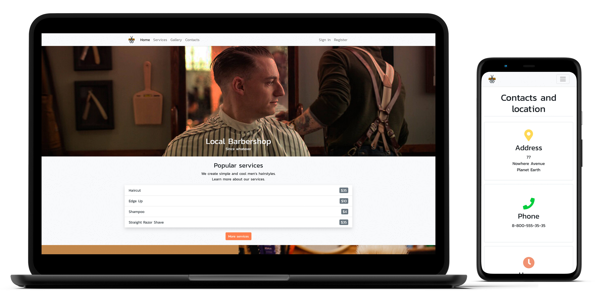

# Local Barbershop App


Bootstrap 4  
React, React Router, Redux, Redux Thunk  
Express.js, Mongoose  
MongoDB  
Docker

### To be able to run app, you need to take the following steps:

*  Clone repository

*  Run database (see instructions below)

*  Set up your Cloudinary to store user avatars (see instructions below)

*  Open `server` directory in terminal and run `npm install`, then `npm run dev`

*  Open `client` directory in separate terminal and run `npm install`, then `npm start`

*  Your default browser will automatically navigate to http://localhost:3000/

### How to run MongoDB database:

*  Install [Docker](https://www.docker.com/get-started)

*  Build and run container via instuctions in [Dockerfile](/db/Dockerfile)

### How to set up Cloudinary:

*  Create a free account on [cloudinary.com](https://cloudinary.com/)

*  Set the environment variable for the server as follows: `CLOUDINARY_URL=cloudinary://<my-key>:<my-secret>@<my-cloud-name>`

***

### Deploy to Heroku

* [Register an account](https://signup.heroku.com/)

* Create a project via Heroku CLI: `heroku create`

* Add a Heroku remote to an existing git repo, instructions can be found [here](https://dashboard.heroku.com/apps/), select your project, then the "Deploy" tab

* Set environment variables in the settings tab:
```
// Example

CLOUDINARY_URL=cloudinary://<my-key>:<my-secret>@<my-cloud-name>
HTTPS=enabled
MONGODB_URL=mongodb+srv://<user-name>:<password>@cluster0.rugmj.gcp.mongodb.net/<dbname>
REACT_APP_API_URL=<https://<your-project-name>.herokuapp.com>
```

* `git push heroku master` or `git push heroku <your-branch>:master`
